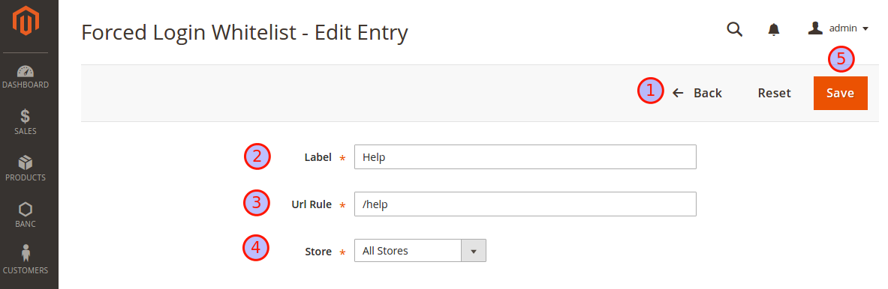

# Force Login Module for Magento® 2
The **Force Login** Module for *Magento® 2* allows you to restrict which pages a visitor is
able to see. Visitors get redirected to the login page if the page is not marked visitable.
The **Force Login** Module for *Magento® 2* is especially useful for merchants serving only a specific
group of users, e.g. enterprise related business partners and need to ensure that only those users are
able to browse the the website or the product catalog.

## Features:
* Force your guest visitors to log in first (or register), before allowing them to visit your pages and catalog
* Administration: Manage the whitelist rules by the GUI in the administration area
* ACL: Restrict the administration of whitelist rules to certain backend user groups
* Whitelisting: Define url rules as pattern to define which pages guest visitors can visit without logging in first
* Multistore-Support: Define if whitelist rules either apply globally or for specific stores

## Installation
The preferred way of installing `bitexpert/magento2-force-customer-login` is through Composer. Simply add `bitexpert/magento2-force-customer-login` 
as a dependency:

```
composer.phar require bitexpert/magento2-force-customer-login
```

Optional you can download the latest version [here](https://github.com/bitExpert/magento2-force-login/releases) and install the
decompressed code in your projects directory under *app/code/bitExpert/ForceCustomerLogin*.  

# User Guide
Find the complete user guide [here](./docs/UserGuide.pdf "User Guide").

## How to use
The usage of the **Force Login** Module for *Magento® 2* is applied implicitly by redirecting visitors 
if the called URI does not match any configured whitelisted url rules.

## How to configure

### Navigation
Navigating through the *Magento® 2* backend menu by clicking onto **Customers** you must see a new menu 
entry **Forced Login Whitelist**. 

Enter this menu entry.


### Overview Grid
You can add new entries by clicking on the *Add Entry* button in the upper right corner ( **1** ), [see below](#detail-form). 
The grid ( **2** ) contains all existing whitelisted *Url Rules*, for which the forced redirect to the *Customer Login Page* is omitted.
The *Url Rules* ( **3** ) are part of a regular expression checking on the called *Url* and tries to match against the whitelist.
*Url Rules* may be related to all stores or to a specific one ( **4** ). All rules except some mandatory ones are editable ( **5** ) and removeable ( **6** ).


### Detail Form
You can return to the *Overview Grid* by using the *Back* button ( **1** ). The *Label* value has only declarative character and
is for information purpose only ( **2** ). The *Url Rule* is part of a regular expression checking on the called 
*Url* and tries to match against the whitelist ( **3** ). *Url Rules* may be related to all stores or to a specific one ( **4** ).
Persist the rule by using the *Save* button ( **5** ).



## Contribution
Feel free to contribute to this module by reporting issues or create some pull requests for improvements.

## License
The **Force Login** Module for *Magento® 2* is released under the Apache 2.0 license.
